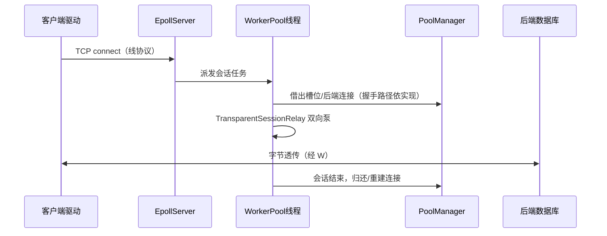

# DB-Proxy 从零到参与开发：学习指南

面向：**第一次接触本仓库**、目标是在数周内能**读懂代码、改小功能、跑测试、做维护**的开发者。  
相关文档：[README.md](../README.md)（权威行为说明）、[ROADMAP.md](../ROADMAP.md)（演进方向）。

---

## 1. 学完本指南，你应该能做什么

| 能力 | 标志 |
|------|------|
| **说清项目在干什么** | 能用自己的话解释「透明中继」「池槽位」「和直连连接池的区别」 |
| **本地跑起来** | 能编译 `db-proxy`，用 `conf/` 里配置连上本机 MySQL/PG（或至少跑通无需库的测试） |
| **定位代码** | 给定「监听 / 借连接 / 透传 / 还池 / 监控」之一，能指到主要类与文件 |
| **安全做小改动** | 能改日志/配置项/指标名并跑 `ctest`；知道主路径上哪些改动风险高 |
| **接新需求** | 能对照 ROADMAP 判断属于哪一层，并拆成可测的小步 |

---

## 2. 项目一句话与常见误解

**一句话：**  
`db-proxy` 是一个 **C++20** 写的程序：在固定端口上 **接受数据库客户端的 TCP 连接**（MySQL 或 PostgreSQL **线协议**），用内部 **连接池** 限制并发、做预热与健康检查；对每个客户端会话，在 **客户端套接字** 与 **一条到后端的 TCP** 之间做 **双向字节透传**（不解析业务 SQL）。

**容易误解的点（务必先读）：**

1. **「连接池」在这里多数指「槽位 + 后端连接」管理**  
   主路径**不是**把同一条已握手的数据库连接轮流给多个客户端用（线协议不允许）。而是：池里维护若干条到后端的连接；每个客户端会话**占用一个槽位**，会话期间自己的字节流走自己的后端 TCP。

2. **`include/protocol/` 里的 MySQL 解析、中继**  
   主要给 **示例、`dbcli`、测试** 或未来扩展用；**主程序默认路径不做 SQL 级解析**。改主路径行为前先读 [README.md](../README.md) 里「主程序在做什么」表格。

3. **监控里的「慢查询」**  
   很多配置项对应的是 **代理会话时长** 等会话级指标，**不等于**数据库慢查询日志里的单条 SQL（除非你在别的路径接了 SQL 解析）。

---

## 3. 环境与第一次运行

### 3.1 依赖

- **CMake** ≥ 3.20、支持 **C++20** 的编译器（Clang / GCC）。
- **Linux**：完整 epoll 路径；**macOS**：监听侧为 **select** 回退，可开发与跑大部分测试。
- **PostgreSQL 池**：CMake 需找到 **OpenSSL**，否则 PG 池会被关掉，只能编 MySQL 相关路径。

### 3.2 编译

```bash
mkdir -p build && cd build
cmake .. -DCMAKE_BUILD_TYPE=Release
make -j$(sysctl -n hw.ncpu 2>/dev/null || echo 4)
```

产物在 `build/`：`db-proxy`、`diagnostics_demo`、`test_*` 等。

### 3.3 建议的「零数据库」第一步

不连真实库也能建立信心：

```bash
cd build
./test_pooled_session_relay
./test_monitor_integration
ctest --output-on-failure
```

再读配置、试主程序（需本机有库或 Docker）见 [README.md](../README.md) 的「运行主程序」「自动化测试」。

### 3.4 可选：智能诊断演示（Ollama）

见 README「智能诊断示例」；需要本机 [Ollama](https://ollama.com) 与已拉取的模型。

---

## 4. 仓库地图（该打开哪个目录）

```
db-proxy/
├── README.md              # 行为与配置权威说明（先通读一遍）
├── ROADMAP.md             # 产品/技术分阶段路线
├── conf/                  # 示例 INI：MySQL / PG 分开
├── src/main.cpp           # 主程序入口：监听、工作池、会话中继、监控钩子
├── src/network/           # EpollServer、TcpConnection、EventLoop
├── src/pool/              # ConnectionPool、PoolManager、Connection、PG 连接
├── src/protocol/          # 透明会话中继、MySQL 包/解析/中继（主路径用透明中继）
├── src/monitor/           # Metrics、Statistics、HTTP /metrics、PerformanceAnalyzer
├── src/core/              # Logger、Config（INI 解析）
├── src/diagnostics/       # 诊断引擎、Ollama、报告生成（独立链路，非主路径必需）
├── include/               # 与 src 一一对应的头文件
├── examples/              # 场景化示例（含多池、读写路由演示思路）
├── tests/                 # 单元/集成测试入口
└── docs/LEARNING.md       # 本文件
```

---

## 5. 核心概念小词典

| 术语 | 含义 |
|------|------|
| **线协议** | 客户端驱动按 MySQL 或 PostgreSQL 规定的二进制报文说话；代理只转发字节流时需保持兼容。 |
| **EpollServer** | Linux 上监听与新连接侧的 **epoll ET** 循环；**不要**在里面做长时间阻塞 I/O。 |
| **RequestWorkerPool** | `main.cpp` 内固定大小线程池；**每个客户端会话的后端透传**在这里跑，避免阻塞 epoll 线程。 |
| **TransparentSessionRelay** | 客户端 fd ↔ 后端 fd 的 **poll + recv/send** 双向泵。 |
| **PoolManager / ConnectionPool** | 多库多池注册、借还、预热、健康检查；类型由配置 `protocol` 决定 MySQL 或 PG 连接类。 |
| **Metrics / Statistics** | 计数器、Gauge、滑动窗口等；可选暴露 Prometheus 文本。 |
| **loadConfig** | 读 INI，填 `DatabaseConfig` 等；改配置项通常动 `config.cpp` / `config.h` 与 `conf/*.conf`。 |

---

## 6. 推荐阅读顺序（按周可自行压缩）

### 第一周：建立正确心智模型

1. [README.md](../README.md) 全文（至少到「配置文件」一节）。  
2. `src/main.cpp` 文件头 **注释**（约前 32 行）：职责、线程模型、历史 Fix 标签。  
3. `include/protocol/transparent_session_relay.h` + `src/protocol/transparent_session_relay.cpp`：透传在干什么。  
4. `include/pool/pool_manager.h` + `src/pool/pool_manager.cpp`：池如何注册与借还（不必一次读完所有分支）。

**自检：** 能画一张「客户端 → 代理端口 → 工作线程 → 后端」的方框图，并标出 epoll 线程与工作线程分工。

### 第二周：网络与配置

1. `include/network/epoll_server.h` + `src/network/epoll_server.cpp`：accept、ET、非 Linux 回退。  
2. `include/network/tcp_connection.h` + `src/network/tcp_connection.cpp`：与 EpollServer 如何协作、`releaseFd` 等。  
3. `include/core/config.h` + `src/core/config.cpp`：INI 键如何映射到结构体。  
4. 对照 `conf/proxy.mysql.conf`（或 PG）走一遍启动时读了哪些键。

**自检：** 能解释 `-c` 未指定时默认找哪个路径。

### 第三周：监控、测试与工具链

1. `include/monitor/metrics.h`、`statistics.h`；可选读 `metrics_http_server`。  
2. `tests/test_monitor_integration.cpp`、`tests/test_pooled_session_relay.cpp`：断言在保护什么行为。  
3. `examples/examples.cpp` 前几个场景：库式连接池与主程序差异。

**自检：** 能改一个指标名或日志文案，并 `make && ctest` 全绿。

### 第四周及以后：按需深入

- **MySQL 协议路径：** `mysql_packet`、`mysql_parser`、`mysql_relay`（与 `dbcli` 联读）。  
- **诊断模块：** `include/diagnostics/*.h`、`examples/diagnostics_demo.cpp`。  
- **演进规划：** [ROADMAP.md](../ROADMAP.md)，选与当前兴趣最接近的一两个里程碑跟进 PR。

---

## 7. 主程序：一次客户端会话（简化时序）

下面省略错误与超时分支，只保留主干理解用。



**你要改的代码多数在：** `main.cpp`（策略、线程池、与池/中继的衔接）、`transparent_session_relay.cpp`（泵逻辑）、`pool/`（借还语义）、`config`（开关）。

---

## 8. 常见开发任务 → 该动哪里

| 你想做… | 优先看的代码 |
|----------|----------------|
| 加配置项、默认值 | `config.h` / `config.cpp`、`conf/*.conf`、README 表格 |
| 改监听端口、日志路径 | INI + `main.cpp` 里 `loadConfig` 使用处 |
| 会话 idle 超时、缓冲区 | `transparent_session_relay`、相关 `TcpConnection` |
| 新指标或 `/metrics` 文案 | `metrics.cpp`、HTTP server、必要时 `main.cpp` 打点 |
| 池行为（等待时间、ping） | `connection_pool.cpp`、`pool_manager.cpp`、`connection.cpp` |
| 仅工具/示例协议解析 | `protocol/mysql_*`、`dbcli`、`examples` |
| 诊断/Ollama | `src/diagnostics/*`、`examples/diagnostics_demo.cpp` |

**高风险区（改前写测试或先问 reviewer）：** 透传循环里的读写顺序、池归还与 `COM_QUIT`/PG 终止、epoll 线程里是否引入阻塞。

---

## 9. 测试与本地质量习惯

```bash
cd build
ctest --output-on-failure
```

- **不依赖 MySQL：** `test_pooled_session_relay`、`test_monitor_integration`。  
- **依赖本机 MySQL：** `test_pool` 需环境变量开启（见 README）。  

改 `pool/`、`protocol/transparent_session_relay` 时，至少跑与监控相关的测试；若动配置解析，跑 `test_monitor_integration`。

---

## 10. 进阶与长期学习

- **演进方向：** [ROADMAP.md](../ROADMAP.md) 按阶段有里程碑与验收建议。  
- **面试/架构叙事：** 仓库内 `interview-guide.md`（若有）可与 README 对照，以 README 行为为准。  
- **C++ 并发：** 熟悉 `std::jthread`、`stop_token`、`mutex`/`condition_variable` 在本项目中的用法后再做大规模线程模型改动。

---

## 11. FAQ

**Q：我该从 `db-proxy` 还是 `examples` 学起？**  
A：理解产品从 `db-proxy` + README；理解「库式连接池」从 `examples` 更短。

**Q：为什么有两个「中继」相关名字？**  
A：`TransparentSessionRelay` 是主路径字节透传；`mysql_relay` 等更偏协议级演示与工具链，读代码时注意 `#include` 实际走的是哪条。

**Q：我想加「SQL 审计」行不行？**  
A：行，但属于 **SQL 感知** 能力，默认主路径不做解析；需单独设计缓冲、协议状态与性能影响，并对照 ROADMAP 第二阶段。

**Q：遇到问题先查什么？**  
A：日志级别与 `[monitor]`；`Logger::init` 与日志路径；配置是否被正确加载（启动日志里常有路径）。

---

## 12. 修订记录

| 日期 | 说明 |
|------|------|
| 2026-05-12 | 初版：零基础路径、地图、阅读顺序、任务索引与 FAQ |

欢迎在本文件末尾追加你在学习过程中整理的「坑位笔记」链接或章节（团队内部分享时很有用）。
